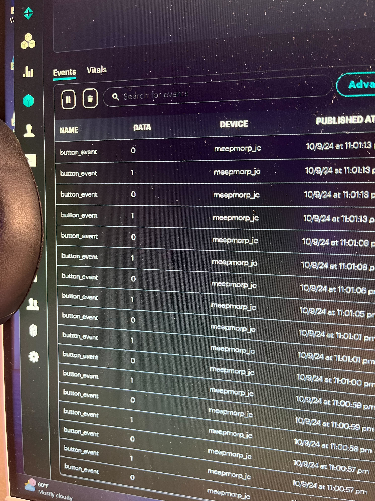
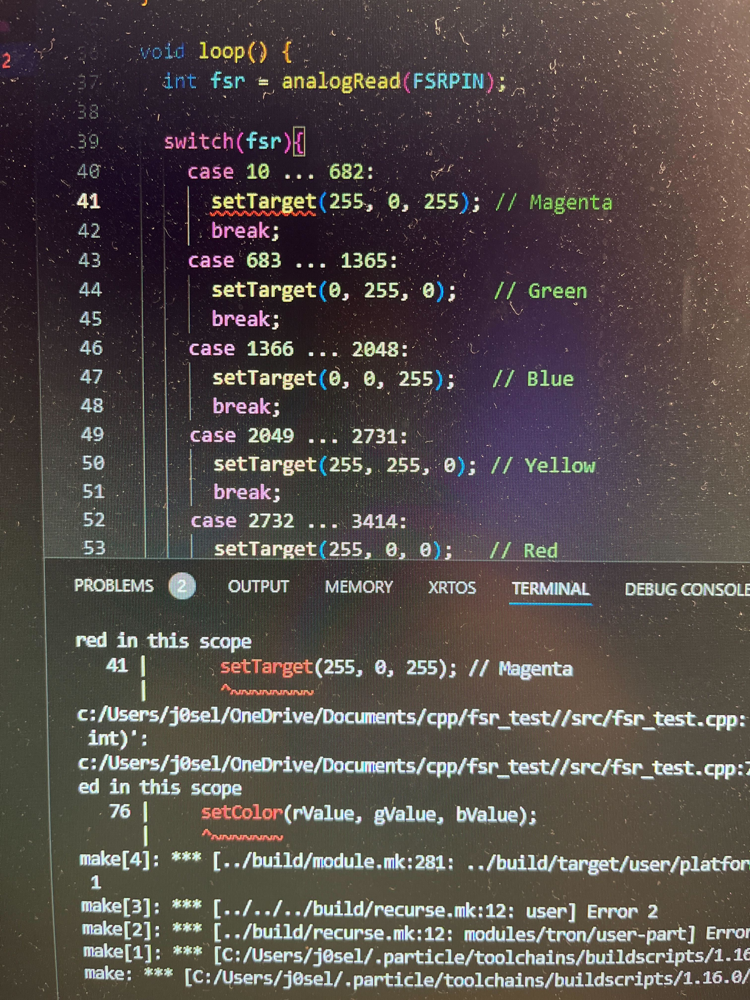
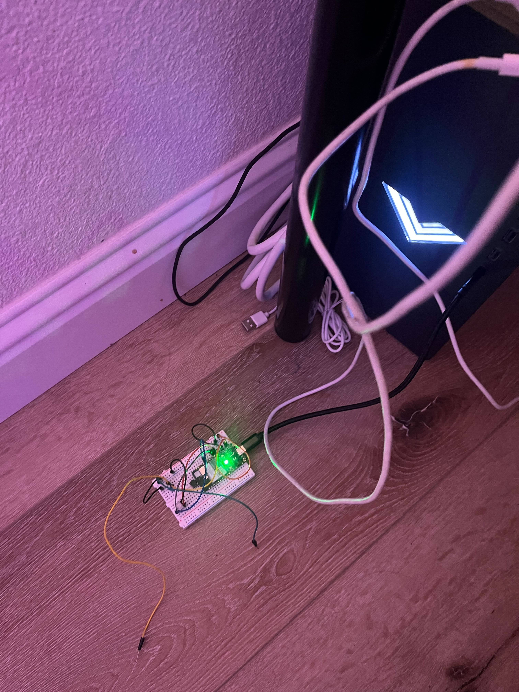
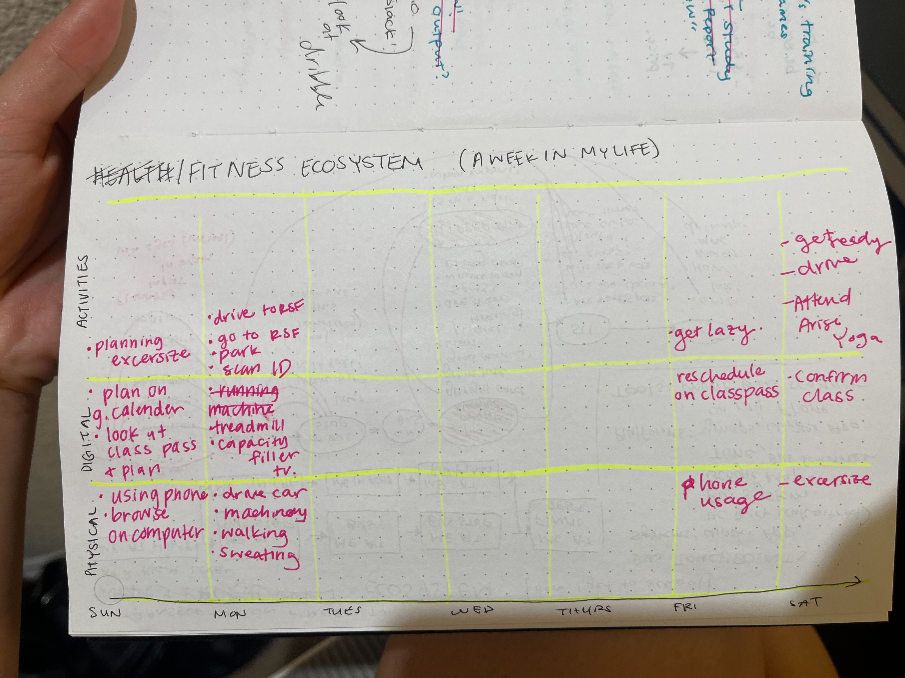
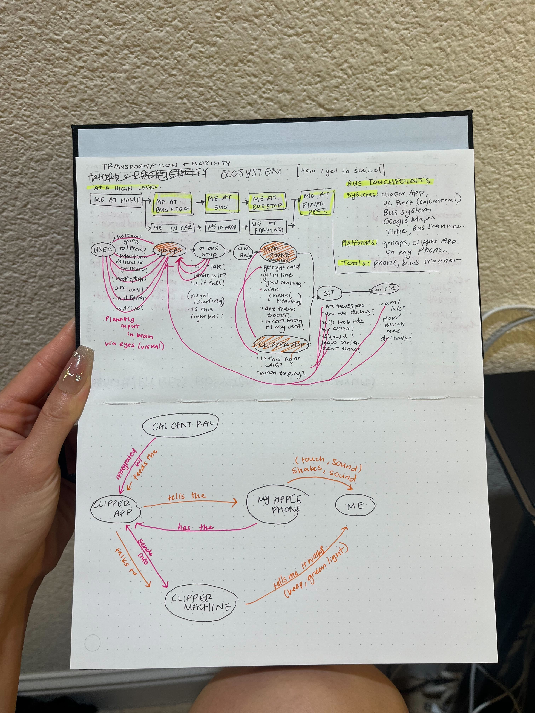
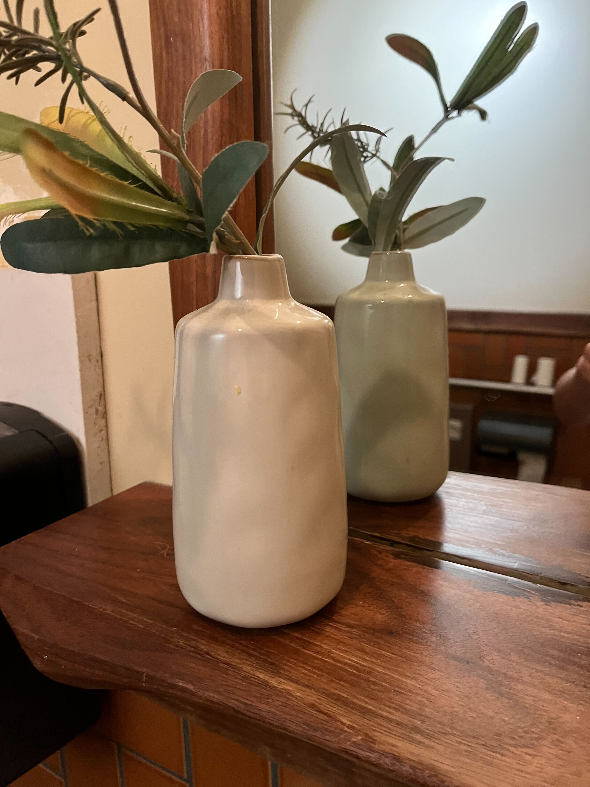
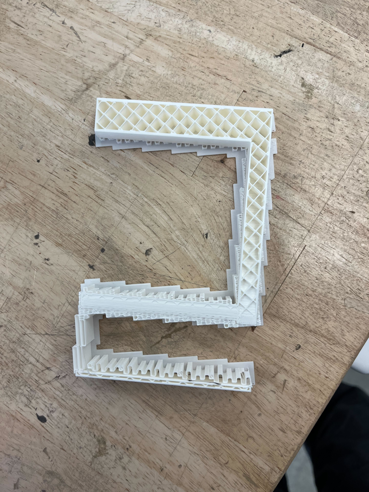
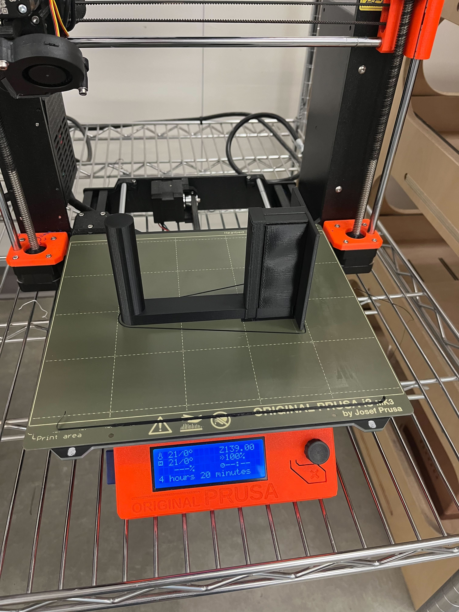
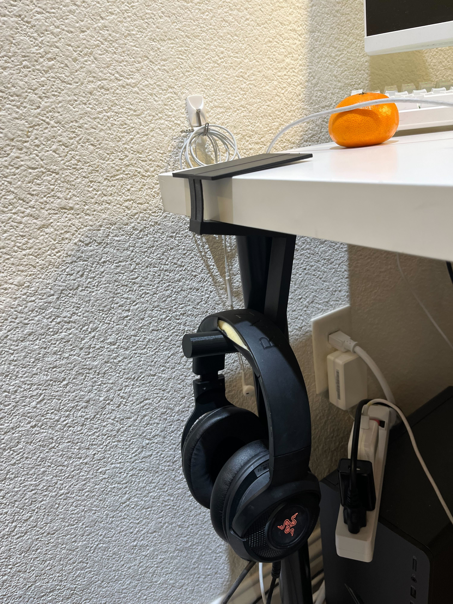

# Welcome to Joseline's `README` 👩🏻‍💻
## Week 6: Progress Report 5 - 10/10/24
Hi there. Happy week 6! It is spooky season officially. 

#### Reflections
I learned how to connected my particle 2 to my home network via the VPN. I had some help from Baurzhan which was very helpful. I had to download GlobalProtect as well as Particle CLI and played around with some terminal commands to successfully connect my particle 2. It worked out and I'm glad I am able to work on the micro-controller from home. I watched the tutorials, asked Chatgpt, and feel more comfortable using the particle 2. Although I'm deeply behind on my assignments, I am making general progress to catch up.

 **Pictured Below:** My button data 

 **Pictured Below:** Bugs on my Code 

 **Pictured Below:** My particle I connected at home via VPN! 

#### Speculations
My FSR sensor wasn't correctly sensing at the right places. I believe my pins are not at the right spot, but I can't tell from the pictures provided from the tutorials. I'm speculating that my final project 2 for TDF may include some sort of sensor. It was easier than I thought. To be honest, the explanations are really really hard to follow, but the images I can just do. It is satisfying, it feels like i'm completing a puzzle or crocheting. I know this stuff really stresses me out, so I made sure to get comfy, put on a movie, and get ready to work...

## Week 5: Progress Report 4 - 10/03/24
Hi there. This week has been very challenging for me in TDF. I've been preoccupied with personal things and work related things and did not have the opportunity to take time on TDF as I wanted to. 

I am meeting with a TA to get help; rather than lag behind. Additionally, I've been trying to show up to the Mdes Studio where my other peers are working on our assignments. So I can work with them-- rather than trying to figure it out on my own in my apartment late at night. 

In terms of progress

#### My Reflections
* I had many issues getting my photon 2 to come online. I had to go through Device Doctor and Chatgpt to eventually get it online.

* I'm having issues with flashing the code that was provided.

* This is my final output for Button Led Pulse

#### My Speculations
* I will improve by connecting with my peers for help
* I will improve if I continue to ask ChatGPT for help
* I realized this type of work is unnecessary for me as I'm primarily a product designer and more focused on the bigger picture-- rather than to get it to work. 
 

## Week 4: Progress Report 4 - 09/26/24

Hi! It is the last week of September which is exciting. This week was much slower compared to the frenzy of TDF Project 1. Now we're moving into understanding the digital ecosystem.

#### My Speculations
* I will need to spend time learning firmware/hardware as it is unfamiliar to me. I've seen my friends arduino things together so I've seen it in real-life.
* I'm excited to work with really smart people to create something exciting.

#### My Blockers/Fears
* I've never done firmware before
* I missed monday's class because I was sick

#### My Plans
* Finish the assignment
* Study the powerpoint provided and have a good idea of the firmware model and how humans interact with it.
* How will I achieve platypus?

Here are two iterations of my digital ecosystem. I initially did health and fitneess, but felt it was too high-level and not interesting. So I tried again with more conceptual models of transportation & mobility. 

 **Pictured:** My health and fitness network map 

   

 **Pictured:** My transportation and mobility network map 

   
T&M were more interesting to me; especially because I can either drive or take the bus. The bus path has more interconnected technology that make it relatively painless for me. I realized i'm highly dependent on Google Maps throughout my entire journey. Interesting. I'm also curious about how the Clipper App, Clipper Machine, and CalCentral are connected. These are very interesting things I want to explore. 

## Week 3: Progress Report 3 - 09/19/24

 

#### My Reflections on the TDF Project 1
Ugh, my report disappeared so now I'm re-writing it. So if you read and its choppy, its because I'm annoyed that I'm rewriting this.

Here are vases I was originally going to 3d model/print.

 

 **Pictured:** Two vases I saw that piqued my interest whilst enjoying my Saturday in San Francisco 

I decided to model a headphone stand instead. It was great with learning.

  

 **Pictured:** Picture 1 is my first 3d print, and picture 2 is my final attempt 

 **Pictured:** My final print technically works, but the measurements are off. This is due to PrusaSlicer issues or Grasshopper issues. Something I did wrong for sure. 

#### My Proudest Accomplishments
- [x] Spending time learning some new markdown formatting. Look at this cool checklist. _Sick, right?_ Also adding images.
- [x] 3d printing/modeling

## Week 2: Progress Report 2 - 09/12/24

Hi! This is my second progress report for TDF. A lot has been happening and we're in the third week of school. It has been busy, to say the least. 

#### My Reflections
* First half of this "week" was figuring out how to laser-cut. It was very nerve-wracking, but I did it and now I feel like I am a video game character that level-ed up and unlocked a skill. The next thing is 3d printing, but in order to 3d print; I need to 3d model. And I made the executive decision to prioritize other things in my life over TDF. I know I want to learn technical skills, so this is still very important to me. I also acknowledge that setting this aside means I have to pick up more slack when I come back to this.

#### My Proudest Accomplishments
* Looking ahead and timing submitting Github Progress Reports on time and consistently.
* Successfully setting up and laserprinting an object. 🎉
* Asking and collaborating with peers to laserprint an object. Watching their process.
* Spending a significant amount of time understand what Grasshopper does generally.
* Opening and testing grasshopper to some extent.

#### My Speculations
* Why does the professor want us to do Grasshopper when there are other tools like Blendr or even AI Text to CAD? I think I know why, but I want him to say why.

#### My Blockers/Fears
* This week I prioritized working on my portfolio and the studio class over TDF. I recognize that I didn't spend much time really getting to know Grasshopper/Rhino as I should have.
* I'm horrible at math and using grasshopper requires a level of geometry and calculus that I've forgotten. 
* I can't download Rhino on my personal laptop so I can't follow along in class.
* I'm afraid I'm not giving myself enough time to understand grasshopper at a deeper level.
* I get really tired at 5 PM when we're having class and it is hard for me to pay attention by the time it is 5 pm. I've been trying to bring snacks to prevent being completely exhausted.
* I'm afraid of submitting the TDF project due next Wednesday. I don't think I've learned much and don't have much to showcase from the last few weeks.
 
#### My Plans
* Next week, carve more time to practice Grasshopper/Rhino.
* Learn markdown formatting to add photos into this Github .readme file
* Ask others for help (peers, professors, design specialists, chatgpt)
* Submit the TDF project 1 on time.
* 3d print anything. 

  

## Week 1: Progress Report 1 - 09/05/24

Hi there! Welcome to my first entry of my progress report. This past week has been very stressful in the TDF world. I think this component/class is where I am the weakest because I avoided anything CS/math related throughout highschool/university. I am naturally adverse to anything technical, which is ironic because I am doing my Master of Design in Emerging Technology. 

#### My Reflections
* This course is definitely the most stressful and nerve-wracking due to my lack of technical skill. It requires me to stay up-to-date and very cognizant of what I do know and what I will need to learn (and the time it takes to learn) and how I will learn it. As a result, I've been thoroughly reading through all things and asking questions wherever I have concerns. (Asking in Slack, Whatsapp, Chatgpt, etc. I also reinforce a reminder that I'm here optionally and I'm paying for this. So get asking!!!) I've begun to notice an immediate pay-off (resulting from my fears): it seems some of my peers are asking the same questions, but days after I resolved them. Maybe my fear of being behind is forcing me to be so proactive that maybe I'll be "successful"? (Whatever I define as "success.")
* I reached out to my friends and chatgpt to understand how Github works and how to use it.
* I reached out to tutorials and videos to understand how Rhino works and how to use it.
* I think I am in a solid spot because I'm being very proactive.

#### My Proudest Accomplishments
* I spent a significant amount of time with Chatgpt understanding what Github even is, how it works, and why we are using it. (I also spent time understanding how Github relates to business users, developers, and product designers). ((I segwayed into learning how Jira integrates with Github))
  * From my understanding, Github houses the code and here is where you store any code-changes via branches. It is also good for collaboration/version control/asset keeping.
  * (((I forced a developer friend of mine to teach me how to write progress reports the easy way. He mentioned that the way I'm doing it right now is not industry-standard but the "easy-way". When deciding between which path to take; I'm a designer and I don't think its necessary for me to do it the industry-way...)))
* I spent a significant amount of time reading all the various links on Github so now I have a clear understanding of what is expected out of me and what I can come to expect in the coming weeks/months in the TDF course.
* I downloaded and watched several Rhino tutorials and have a very baseline understanding of how it all works.
* I watched/read up about the requirements for the first project of computational design.

#### My Speculations
* I'm excited that Github isn't as scary as it was last week. I can commit changes and navigate throughout pages. It will continue to be easier as I learn specific markdown formatting over time.
* I'm excited to actually 3D print something. I know it is probably easier than I'm making it out to be in my mind.
* I'm curious how the AI/ML portion will integrate into this phone stand design. I've been thinking about how I often prop my phone up on my laptop during class to hide my phone usage from professors. Sometimes I also prop my phone up during meetings when my camera is on so I can scroll on my phone whilst not looking away from the general camera square. 

#### My Blockers/Fears
* I don't really understand the difference between computational designer and product designer. I watched some of the videos but it started blurring/getting fuzzy in my mind.
* I don't know how to 3D model --> 3D print. I need to try it out myself this week.
* I am scared of burning my skin and giving myself an allergic reaction. 

#### My Plans
* I want to ask Mia how to use 3D printing. She seems to know a lot and I could learn a lot from her expertise from a peer-to-peer perspective.
* I need to spend time actually 3D printing something. Anything. I'm thinking something cute and funky like a Smiski. That is the most daunting process to me. 
* I need to watch more tutorials on how to create 3D models in Rhino and exporting to the Jacob's computer to print.
* I need to reach out in-person to my professors, design specialists, and faculty to introduce myself as a person.
* I need to figure out Grasshopper altogether. That part I left out because its a plug-in.
* I need to review markdown formatting page. 

## Week 0: Example Report 0 - 09/05/2024

This week, I designed a cool phone stand made of rocks. Check out all my cool sketches and progress photos from this week below, etc., etc....

<!---
#### My Reflections
#### My Proudest Accomplishments
- [x] Spending time learning some new markdown formatting. Look at this cool checklist. _Sick, right?_
#### My Speculations
#### My Blockers/Fears
#### My Plans
- [ ] Meep Morp
- [ ] Meep Morp
- [x] Meep Morp

# Hello DES INV 202 Student!
Welcome to your new GitHub repository! 

# Outline
[week 1](README.md#week-1-example-report-1)

week 2, etc...

---

# Github Background Information & Context
If you’re new to GitHub, you can think of this as a shared file space (like a Google Drive folder, or a like a USB drive that’s hosted online.) 

This is your space to store project files, videos, PDFs, notes, images, etc., and (hopefully, neatly) organize so it's easy for viewers (and you!) to navigate. That said, it’s super easy for you to share any file or folder with us (your TDF instructional team) - just send us the link!  As a start, feel free to simply add images to the `/assets` folder, which is located [here](/assets). 

The specific file that I’m typing into right now is the **README.md** for this repo. 
##### (💡 TIP: The .md indicates that we’re using [Markdown formatting.](https://www.markdownguide.org/cheat-sheet/)) #####
<h6> (💡 TIP 2: GitHub Markdown supports <a href="https://gist.github.com/seanh/13a93686bf4c2cb16e658b3cf96807f2"> <em>HTML formatting</em> too, including emojis 😄</a>, in case that helps!) </h6>

### :star: Whatever you write in your **README.md** will show up on the “front page” of your GitHub repo. This is where we’ll be looking for your [weekly progress reports](https://github.com/Berkeley-MDes/24f-desinv-202/wiki/3.0-Weekly-Submissions#weekly-progress-report). They might look something like this: ###

## Quick Links, compiled here for your convenience: ##

- [TDF Wiki](https://github.com/Berkeley-MDes/24f-desinv-202/wiki) - the ultimate source for truth and information about the course and assignments
- [Google Drive Folder](https://drive.google.com/drive/u/0/folders/1DJ1b6sSDwHXX6NRcQYt10ivyQSgU0ND6) - slides and other resources
- [bCourses](https://bcourses.berkeley.edu/courses/1537533) - where the grading happens
-->
